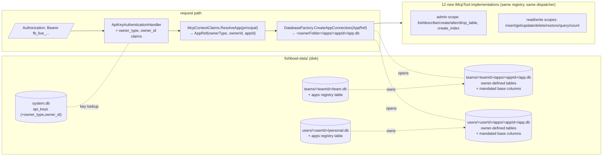

# Apps platform — implementation plan

**Status:** Plan for review.
**Deliverable:** Ship the *App* concept as a first-class file boundary nested under its owner (Team or User), so an agent can store typed structured data (transactions, receipts, future record types) via Bearer-authenticated MCP/REST without bolting a parallel SQLite stack on the side. Personal-Assistant is the first consumer; the design generalises to any future App.

## Context

CONCEPT §Apps has always envisioned mini-apps with their own SQLite, their own schema, their own access rules. Until now it has been a future-design note. Personal-Assistant pushes on it: it wants typed structured rows (transactions today, receipts/budgets/etc tomorrow), and the alternative — a parallel SQLite + MCP plumbing next to Fishbowl — would create a forklift-migration debt later.

Design direction settled in this planning session:

- **CONCEPT-treu, not lean-bolt-on.** Each App lives in its own `app.db`.
- **Real SQL tables with real columns** the App owner defines via `app_create_table` / `app_alter_table`. No JSON-blob masquerading as schema.
- **Apps nest under their owner.** No `apps` table in `system.db`. App registry lives in the owner's DB (`team.db` or `personal.db`). `system.db` only learns that some api_keys point at an `app` context (two new nullable columns).
- **Bearer token IS the App scope.** No `app_id` argument on MCP tool calls.
- **Mandatory base columns** on every app-defined table (`id / title / author / created_at / last_modified / row_version / is_deleted / deleted_at / additional_data`). Server-injected at `CREATE TABLE`.
- **`additional_data`** is a JSON ride-along escape hatch — agents may read/write it, the structured query DSL rejects filters on it.
- **App data never bleeds into global Fishbowl search.** Notes/contacts/events/todos stay untouched.
- **No FTS / vector / triggers / form-builder UI in MVP.** Individually-scoped follow-up stories.
- **Query DSL = MongoDB-style JSON operators.** Established wire-format shape, no NuGet dep; we write a ~150 LOC validator+SQL builder with sandboxing caps.

---

## Architecture (the shape, before the substance)



The four moving parts that have to fit together: (1) `api_keys` learns to bind to apps; (2) a new `AppRef` carries owner+app routing info; (3) `DatabaseFactory` opens app DBs given an `AppRef`; (4) two repositories (schema + rows) plus a DSL translator drive the 12 MCP tools and a parallel REST mirror.

---

## Decisions and trade-offs

| Topic | Decision | Why |
|---|---|---|
| Where apps live | Nested under owner (`<owner-folder>/apps/<appId>/app.db`) | Drop a team folder onto another instance and the team imports with its apps; team-deletion naturally cascades; no global app namespace |
| App ownership | Team **or** User (both supported) | Personal-Assistant needs personal apps without forcing the user to open a team |
| Slug scope | Unique within owner, not globally | Two owners may both have an app called `todos` |
| App-DB schema | Empty at create; owner brings in tables via `app_create_table` | Real SQL, real columns; no shadow schema |
| Base columns | Server-injected, undroppable, unrenamable | Row hygiene baseline (id, soft-delete, audit, additional_data) |
| `additional_data` cap | 256 KB hard from MVP | Prevent agents writing megablobs that pin SQLite |
| DSL flavor | MongoDB-style JSON: `{amount: {$gt: 5}, $and: [...]}` | Established convention, LLMs trained on it, no NuGet dep |
| DSL safety caps | depth ≤ 5, leaves ≤ 100, `$in` ≤ 50, `$limit` ≤ 500 | Reject pathological trees before SQLite planner pins |
| Auth scopes | `app:read`, `app:write`, `app:admin` | DDL gated behind admin; data CRUD by read/write |
| Team-app keys inherit team role | Owner → admin, Member → write, Readonly → read | Single role surface, no per-app membership table |
| `ContextRef` shape | Add `App` to `ContextType` enum + factory `ContextRef.App(string appId)`. The full owner/app routing tuple lives in a separate `AppRef` carried via claims. | One `ContextType` keeps the dispatcher uniform; `AppRef` keeps owner+app routing out of the existing path resolver. Existing Note/Event/Todo repos never see App tokens (scope-gating blocks them). |
| MCP tool interface | **Reuse `IMcpTool` and `ToolRegistry` verbatim.** App tools resolve `AppRef` from the principal via `McpContextClaims.ResolveApp(principal)` inside `InvokeAsync` and ignore the passed-in `ContextRef.App(appId)`. | Avoids a parallel `IAppMcpTool`+`AppToolRegistry` that just duplicates the existing plumbing. The principal already carries every claim the app tools need. |
| MCP scope-failure code | `InvalidParams` (`-32602`), not `InternalError` | Caller-fixable; aligns with existing `ResourceValidationException` handling in `McpEndpoint.cs:65` (note: existing scope-check at `McpEndpoint.cs:144-148` uses `InternalError` — opportunistically fix while we're here, see Phase B.5) |
| api_keys context_id for apps | Stores `appId` (ULID). New columns `owner_type`/`owner_id` carry the routing pair | Path resolution needs owner; api_key carries everything to route in one lookup |
| api_keys context_id for teams | **Bug noted but out of scope:** today `init-team/Program.cs:149` stores team.Id while `ApiKeysApi.cs:103` stores team.Slug and `TeamsApi.cs:690` compares against team.Slug — inconsistent. Apps will consistently use **ULID id** everywhere. Don't replicate the bug. |

---

## Disk layout

```
fishbowl-data/
  system.db                                  ← api_keys gains owner_type, owner_id; CHECK rebuilt for 'app'
  users/
    <userId>/
      personal.db                            ← gains `apps` registry table (user-schema v6)
      apps/
        <appId>/
          app.db                             ← user-defined tables + base columns
  teams/
    <teamId>/
      team.db                                ← gains `apps` registry table (same v6 migration)
      apps/
        <appId>/
          app.db
```

The `apps/` subfolder is created lazily on first app create. Folder name is the App's ULID (26 chars; well under MAX_PATH on every platform).

---

## Schema changes

### `system.db` — schema v7 (`ApplySystemV7` in `DatabaseFactory.cs`)

SQLite can't ALTER a CHECK constraint in-place. Rebuild:

```sql
BEGIN TRANSACTION;

CREATE TABLE api_keys_new (
    id            TEXT PRIMARY KEY,
    user_id       TEXT NOT NULL REFERENCES users(id),
    context_type  TEXT NOT NULL CHECK(context_type IN ('user','team','app')),
    context_id    TEXT NOT NULL,
    owner_type    TEXT     CHECK(owner_type IS NULL OR owner_type IN ('user','team')),
    owner_id      TEXT,
    name          TEXT NOT NULL,
    key_hash      TEXT NOT NULL,
    key_prefix    TEXT NOT NULL,
    scopes        TEXT NOT NULL,
    created_at    TEXT NOT NULL,
    last_used_at  TEXT,
    revoked_at    TEXT,
    CHECK ((context_type = 'app') = (owner_type IS NOT NULL AND owner_id IS NOT NULL))
);

INSERT INTO api_keys_new
  (id,user_id,context_type,context_id,owner_type,owner_id,name,key_hash,key_prefix,scopes,created_at,last_used_at,revoked_at)
SELECT id,user_id,context_type,context_id,NULL,NULL,name,key_hash,key_prefix,scopes,created_at,last_used_at,revoked_at
FROM api_keys;

DROP TABLE api_keys;
ALTER TABLE api_keys_new RENAME TO api_keys;

CREATE INDEX idx_api_keys_prefix ON api_keys(key_prefix) WHERE revoked_at IS NULL;

COMMIT;
```

The compound CHECK enforces: `owner_*` are NULL for user/team keys, NOT NULL for app keys.

### Owner DBs (`team.db` + `personal.db`) — user-schema v6 (`ApplyUserV6` in `DatabaseFactory.cs`)

```sql
CREATE TABLE IF NOT EXISTS apps (
    id          TEXT PRIMARY KEY,           -- ULID; folder name under apps/
    slug        TEXT NOT NULL UNIQUE,       -- URL-safe, unique within owner
    name        TEXT NOT NULL,
    created_by  TEXT NOT NULL,              -- user id of creator
    created_at  TEXT NOT NULL
);
```

### App DB — base columns mandated on every owner-defined table

Server-injected at `app_create_table`; owner cannot drop/rename/retype them:

```sql
id              TEXT PRIMARY KEY,             -- ULID, server-generated on INSERT
title           TEXT NOT NULL,
author          TEXT NULL,                    -- system.users.id of inserter; NULL for server-side / future-trigger inserts
created_at      TEXT NOT NULL,                -- ISO-8601 UTC, server-set
last_modified   TEXT NOT NULL,                -- ISO-8601 UTC, server-bumped on UPDATE
row_version     INTEGER NOT NULL DEFAULT 1,   -- bumped on every UPDATE; foundation for optimistic concurrency + future Sync
is_deleted      INTEGER NOT NULL DEFAULT 0,
deleted_at      TEXT NULL,                    -- ISO-8601 when soft-deleted
additional_data TEXT NULL                     -- opaque JSON; non-queryable; 256 KB hard cap
```

Mandatory companion index: `CREATE INDEX idx_<table>_is_deleted ON <table>(is_deleted)`. Every default query filters on `is_deleted = 0`, so pay the index upfront rather than degrade to full scans.

### User-defined column types

`text | integer | real | boolean | datetime | json`. Server validates supplied values against column type at INSERT/UPDATE; rejects with 400 + structured error envelope:

```json
{"errors": [{"field": "amount", "expected": "real", "got": "string"}]}
```

Constraints in MVP: `nullable` (default true), `default <value>`, `unique` (single-column only). FK and multi-column UNIQUE out of scope.

### Legal DDL moves

- `CREATE TABLE` (with user-defined columns; base columns injected)
- `ALTER TABLE ADD COLUMN` (always nullable, optional default)
- `ALTER TABLE RENAME COLUMN`
- `ALTER TABLE DROP COLUMN` (SQLite ≥3.35)
- `CREATE INDEX` (single column)

Rejected in MVP: column type change, drop UNIQUE, drop/rename base columns. DDL wrapped in transaction with `PRAGMA busy_timeout = 5000`; if ALTER exceeds 30s, abort + return 408.

---

## Code changes — file-by-file

### Phase B.1 — Foundation (≈0.5 day)

**New files:**

- `src/Fishbowl.Core/AppRef.cs` — `public readonly record struct AppRef(string OwnerType, string OwnerId, string AppId)`. Factory: `AppRef.OfTeam(string teamId, string appId)`, `AppRef.OfUser(string userId, string appId)`. **Separate** from `ContextRef`: routing for app DBs needs three coordinates, but `ContextRef.App(appId)` is what flows through the existing dispatcher/claim path.
- `src/Fishbowl.Core/Models/App.cs` — `Id, Slug, Name, CreatedBy, CreatedAt`.
- `src/Fishbowl.Core/Repositories/IAppRepository.cs` — CRUD on the `apps` table inside an owner DB. Methods: `CreateAsync(ContextRef owner, string slug, string name, string actorId, CancellationToken)`, `GetBySlugAsync(ContextRef owner, string slug, ct)`, `GetByIdAsync(ContextRef owner, string appId, ct)`, `ListByOwnerAsync(ContextRef owner, ct)`, `DeleteAsync(ContextRef owner, string appId, ct)`.
- `src/Fishbowl.Data/Repositories/AppRepository.cs` — implementation; reuses `DatabaseFactory.CreateContextConnection(ContextRef)` since the apps table lives in the owner DB.

**Edits:**

- `src/Fishbowl.Core/ContextRef.cs` — add `App` to the `ContextType` enum and `public static ContextRef App(string id) => new(ContextType.App, id);`. The dispatcher passes this through unchanged.
- `src/Fishbowl.Data/DatabaseFactory.cs` — add `ApplySystemV7` (api_keys rebuild) and `ApplyUserV6` (apps table) following the v5/v6 patterns at lines 252–309. Add new method `CreateAppConnection(AppRef appRef)` returning `IDbConnection`; resolves path as `<UsersRoot or TeamsRoot>/<ownerId>/apps/<appId>/app.db`, creates dir tree, opens with `SqliteOpenMode.ReadWriteCreate`, **does not** load sqlite-vec (no vector index in MVP), runs an empty initializer (app DBs have no built-in schema; PRAGMA user_version stays at 0 until/unless we ship app-engine migrations). Add `ResolveAppPath(AppRef)` public for inspection. **Do not** extend `ResolveContextPath`'s switch (lines 57-62) for `App` — that path is for the legacy two-coordinate refs only; throw `ArgumentException` if `App` lands there to surface accidental misuse.
- `src/Fishbowl.Core/Mcp/McpContextClaims.cs` — add constants `OwnerType = "fishbowl_owner_type"`, `OwnerId = "fishbowl_owner_id"`. Extend `Resolve(principal)` (`:27-38`) to return `ContextRef.App(contextId)` when `context_type == "app"`. Add helper `ResolveApp(ClaimsPrincipal user) → AppRef` reading the three claims; throws `InvalidOperationException` if `context_type ≠ "app"`. App tool implementations call `ResolveApp` inside `InvokeAsync`; the `ContextRef` arg they receive is `ContextRef.App(appId)` and serves only as a routing tag.
- `src/Fishbowl.Host/Auth/ApiKeyAuthenticationHandler.cs:53-61` — when `key.ContextType == "app"`, also emit `OwnerType` and `OwnerId` claims from the api_keys row.
- `src/Fishbowl.Core/Models/ApiKey.cs` — add `OwnerType?`, `OwnerId?` properties.
- `src/Fishbowl.Data/Repositories/ApiKeyRepository.cs:62-88` — when `context.Type == ContextType.App` accept the new `IssueAsync` overload that takes `AppRef`; persist `owner_type`/`owner_id` columns.
- `src/Fishbowl.Core/Repositories/IApiKeyRepository.cs` — add `IssueAsync(string userId, AppRef appRef, string name, IReadOnlyList<string> scopes, CancellationToken ct)`.
- `src/Fishbowl.Core/Mcp/ScopeCatalog.cs` — add `AppRead = "app:read"`, `AppWrite = "app:write"`, `AppAdmin = "app:admin"`; extend `_all` set.

### Phase B.2 — App-DB schema management (≈2 days)

**New files:**

- `src/Fishbowl.Core/Apps/AppTable.cs` — descriptor (`Name`, `Columns: IReadOnlyList<AppColumn>`).
- `src/Fishbowl.Core/Apps/AppColumn.cs` — descriptor (`Name`, `Type` enum, `Nullable`, `DefaultValue?`, `IsUnique`, `IsBaseColumn`).
- `src/Fishbowl.Core/Apps/AppColumnType.cs` — enum + parser + SQL-type-mapping (text→TEXT, integer→INTEGER, real→REAL, boolean→INTEGER, datetime→TEXT, json→TEXT).
- `src/Fishbowl.Core/Apps/BaseColumns.cs` — the eight mandated columns + the soft-delete index helper. Centralised so injection and "can the owner touch this column?" share one source of truth.
- `src/Fishbowl.Core/Repositories/IAppSchemaRepository.cs` — `ListTablesAsync`, `DescribeTableAsync`, `CreateTableAsync`, `AlterTableAsync` (add/rename/drop column), `DropTableAsync`, `CreateIndexAsync`.
- `src/Fishbowl.Data/Repositories/AppSchemaRepository.cs` — DDL generator. Validates column names against `^[a-z_][a-z0-9_]*$`; rejects reserved keywords; rejects base-column overlaps; emits the index on `is_deleted`; transactional, with `PRAGMA busy_timeout = 5000`; aborts ALTER > 30s with timeout.

**New tests:**

- `src/Fishbowl.Data.Tests/Repositories/AppSchemaTests.cs` — every reject case + happy path (create with base injection, alter add/rename/drop, drop table, index creation, base-column protection).

### Phase B.3 — CRUD with base columns (≈0.5 day)

**New files:**

- `src/Fishbowl.Core/Repositories/IAppRowRepository.cs` — `InsertAsync`, `GetAsync`, `UpdateAsync` (PATCH semantics, bumps `last_modified` + `row_version`), `DeleteAsync(soft|hard)`, `RestoreAsync`.
- `src/Fishbowl.Data/Repositories/AppRowRepository.cs` — fills `id`/`created_at`/`last_modified`/`author` from the bearer-principal's user-id (NULL when server-side); enforces `additional_data` ≤ 256 KB (throws `ResourceValidationException` so `McpEndpoint.cs:57-66` returns InvalidParams); coerces and type-validates inputs against the column metadata read via `pragma_table_info`.

**New tests:** `src/Fishbowl.Data.Tests/Repositories/AppRowTests.cs`.

### Phase B.4 — Query DSL (≈0.5 day)

**Wire format (MongoDB-style):**

```json
{
  "where": {
    "amount":  {"$gt": 0, "$lte": 1000},
    "status":  {"$in": ["open", "pending"]},
    "$and":    [{"date": {"$gte": "2026-01-01"}}, {"category": {"$ne": "refund"}}]
  },
  "orderBy": [{"field": "date", "dir": "desc"}],
  "limit": 50,
  "offset": 0,
  "includeDeleted": false
}
```

Operators: `$eq, $ne, $lt, $lte, $gt, $gte, $in, $like, $isNull, $isNotNull`. Boolean combinators: `$and, $or, $not`. `includeDeleted` defaults to `false` (server prepends `is_deleted = 0`).

**Validation rules:**

- Column must exist; rejects `additional_data` with the message: *"`additional_data` is a non-queryable field. Promote it to a typed column via `app_alter_table` if you need to filter on it."*
- Operator must match column type via type-coercion matrix (`$like` only on TEXT, comparison ops only on numeric/datetime, `$in` array elements must match column type).
- Safety caps (return 400 with explicit error on violation):
  - where-tree depth ≤ 5
  - total leaves ≤ 100
  - `$in` array length ≤ 50
  - `limit` ≤ 500 (clamped)

**New files:**

- `src/Fishbowl.Core/Apps/QueryDsl.cs` — JSON shape + validator + SQL builder; parameterised output only.
- `src/Fishbowl.Core/Apps/QueryDslErrors.cs` — error envelope shape.
- `src/Fishbowl.Core.Tests/Apps/QueryDslTests.cs` — operator coverage; `additional_data` rejection; type mismatches; cap-violation rejection; SQL-injection-attempt rejection.

### Phase B.5 — MCP tools, REST mirror, lifecycle, init-app (≈2–3 days)

**MCP — 12 tools using the existing `IMcpTool` interface:**

- `src/Fishbowl.Mcp/Tools/Apps/AppListTablesTool.cs`, `AppDescribeTableTool.cs`, `AppCreateTableTool.cs`, `AppAlterTableTool.cs`, `AppDropTableTool.cs`, `AppCreateIndexTool.cs` — scope `app:admin`.
- `AppInsertTool.cs`, `AppGetTool.cs`, `AppUpdateTool.cs`, `AppDeleteTool.cs`, `AppRestoreTool.cs` — scope `app:write` (delete/restore) or `app:read`/`app:write` as appropriate.
- `AppQueryTool.cs`, `AppCountTool.cs` — scope `app:read`.

Each implements `IMcpTool` and inside `InvokeAsync` does `var appRef = McpContextClaims.ResolveApp(principal);` to fetch the routing triple, then calls `IAppSchemaRepository`/`IAppRowRepository` with `appRef`. The `ContextRef ctx` arg the dispatcher hands in is `ContextRef.App(appId)` — used only for sanity-checking that `ctx.Type == ContextType.App && ctx.Id == appRef.AppId`.

**Dispatcher edit:**

- `src/Fishbowl.Mcp/Endpoints/McpEndpoint.cs:124-172` — no structural change. Two opportunistic fixes while we're in this file: (a) at `:142-148`, return `InvalidParams` (`-32602`) for scope-denied instead of `InternalError` — caller-fixable, aligns with `ResourceValidationException` handling at `:57-66`; (b) at `:153`, return `InvalidParams` too for unresolvable context. Existing tools keep working through the same code path.

**REST mirror — `/api/v1/apps`:**

- `src/Fishbowl.Api/Endpoints/AppsApi.cs` — new file. Routes:
  - Cookie-auth lifecycle: `POST /api/v1/apps` (`{slug, name, owner: {type, id}}`), `GET /api/v1/apps`, `GET /api/v1/apps/{ownerType}/{ownerId}/{slug}`, `PATCH .../{slug}` (rename), `DELETE .../{slug}` (terminal; body `{ confirm: "<slug>" }`; drops the .db file).
  - Bearer-or-cookie data routes (mirroring `TeamsApi` nesting pattern from `:111-637`): `/api/v1/apps/{ownerType}/{ownerId}/{slug}/tables` (and `/tables/{name}`, `/rows`, `/query`, `/count`). `.RequireScope("app:read"/"app:write"/"app:admin")` on each handler.
  - `POST /api/v1/apps/{ownerType}/{ownerId}/{slug}/keys` — mint key (cookie-only); `GET .../keys`; `DELETE .../keys/{id}` — same surface as today's per-user key flow.
- Private helper `ResolveAppAsync(string ownerType, string ownerId, string slug, ClaimsPrincipal user, ...)` mirroring `TeamsApi.ResolveTeamAsync` at `:671-699`: validates owner role (cookie path) and Bearer-context match (Bearer path). For Bearer principals, compare `OwnerType`/`OwnerId`/`ContextId` claims against the resolved AppRef and refuse on mismatch with 403.

**Lifecycle authorization:**

- Personal app (`ownerType=user`): only the owning user mints/revokes keys (cookie auth).
- Team app (`ownerType=team`): keys inherit team role via `TeamRoleExtensions` — Owner mints admin-scope; Member mints write-scope; Readonly mints read-scope; map at key-issuance time.
- System admins (`users.is_admin = 1`, see `AdminApi.cs:38, :232`) can list/inspect/delete any app via existing admin paths — out of scope for MVP but the data model permits it.

**Owner-cascade:**

- Edit `src/Fishbowl.Data/Repositories/TeamRepository.cs` `DeleteAsync` to refuse with `owned_apps_present` when the team's `apps` table is non-empty, unless `cascade=true` is passed (extend the interface signature).
- Same for user-deletion in `src/Fishbowl.Data/Repositories/SystemRepository.cs` (if a user-delete endpoint exists — verify in implementation).

**`tools/init-app`:**

- `tools/init-app/init-app.csproj` — copy of `tools/init-team/init-team.csproj` with `AssemblyName=init-app`, `RootNamespace=Fishbowl.Tools.InitApp`.
- `tools/init-app/Program.cs` — modeled on `tools/init-team/Program.cs`. Required: `<slug>`, `--owner team:<team-slug>` **or** `--owner user:<user-id>`. Optional: `--data`, `--user`, `--name`, `--scopes`, `--key-name`. Default scopes: all three `app:*`. Resolves owner; refuses creating apps on someone else's behalf without an owning-membership; creates app row in the owner DB; mints an api_key bound to `AppRef`; prints raw token to stdout, status banner to stderr. Locked-system.db retry: exponential backoff × 3 attempts (2s/4s/8s), then exit non-zero.
- Add to `Fishbowl.sln` (no entries today — verify root path; if `dotnet sln` is used, run it; otherwise hand-edit).

**DI wiring — `src/Fishbowl.Host/Program.cs`:**

- After line 146 (`IApiKeyRepository` etc), add `IAppRepository, IAppSchemaRepository, IAppRowRepository` as `AddScoped`.
- After line 178 (`IMcpTool` registrations), add 12 more `AddScoped<IMcpTool, App*Tool>()` lines. They join the existing `ToolRegistry` — no second registry needed.
- After line 703 (`MapApiKeysApi`), add `app.MapAppsApi();`.

**Tests:**

- `src/Fishbowl.Host.Tests/AppsApiTests.cs` — end-to-end through `WebApplicationFactory`: create app, mint key, hit MCP endpoint with `tools/call`, round-trip create-table → insert → query → soft-delete → query (includeDeleted=true).
- `src/Fishbowl.Host.Tests/AppCrossContextTests.cs` — key for App-A cannot reach App-B; key for personal app cannot reach team app; key on a deleted app gets 404.

**Docs:**

- `CLAUDE.md` — new Apps section after Scheduler. Brief: ownership model, file layout, scope catalog, init-app usage.
- `docs/deploy.md` — note about `apps/` subfolders in `fishbowl-data` layout.

---

## Critical reuse — don't reinvent

- `ContextRef` (`src/Fishbowl.Core/ContextRef.cs:9-19`) — keep as-is. Apps use the new parallel `AppRef`; existing repos must not be re-wired.
- `DatabaseFactory.ResolveContextPath` (`src/Fishbowl.Data/DatabaseFactory.cs:57-62`) — leave untouched; add a new sibling `ResolveAppPath(AppRef)`.
- `DatabaseFactory.EnsureSystemInitialized` (`:260-310`) — append `ApplySystemV7` arm; mirror the v6 pattern at `:304-309`.
- `DatabaseFactory.EnsureUserInitialized` (`:208-258`) — append `ApplyUserV6` arm.
- `ApiKeyRepository` (`src/Fishbowl.Data/Repositories/ApiKeyRepository.cs`) — extend `IssueAsync` with an `AppRef` overload; persist `owner_type`/`owner_id`.
- `ApiKeyAuthenticationHandler` (`src/Fishbowl.Host/Auth/ApiKeyAuthenticationHandler.cs:53-61`) — emit `OwnerType`/`OwnerId` claims when present.
- `ResolveTeamAsync` (`TeamsApi.cs:671-699`) — mirror as `ResolveAppAsync`; same Bearer-context-id pattern but compare AppId.
- `RequireScope` (`src/Fishbowl.Api/ScopedAuthorizationExtensions.cs`) — reuse verbatim for the three new `app:*` scopes.
- `tools/init-team/Program.cs` — copy-and-adapt for `init-app`; keep the slug validator regex (`^[a-z0-9]([a-z0-9-]{0,58}[a-z0-9])?$`).
- `ResourceValidationException` (path via `McpEndpoint.cs:57-66`) — throw from `AppRowRepository` when `additional_data` exceeds 256 KB so the dispatcher renders the right JSON-RPC error code.
- `Ulid.NewUlid()` — use everywhere we mint app IDs (consistent with team/key/note IDs).

---

## Verification

End-to-end smoke once Phase B.1–B.5 land:

1. `dotnet build Fishbowl.sln` — clean; existing test suite still green.
2. `dotnet format --verify-no-changes Fishbowl.sln` — clean.
3. Schema migration spot-check: open an existing dev `system.db` and assert `PRAGMA user_version = 7` after host start; assert `api_keys` has `owner_type`/`owner_id` columns; assert pre-existing keys still authenticate. Open an existing dev `users/<id>/personal.db` and assert `user_version = 6` and `apps` table exists and is empty.
4. Manual smoke (Personal-Assistant simulation):
   - `dotnet run --project tools/init-app -- transactions --owner team:personal-assistant --name "Personal Assistant — Transactions"` → echoes bearer to stdout.
   - With that bearer, call MCP `tools/call` for `app_create_table` (table `transactions`, columns `date:datetime, amount:real, counterparty:text, category:text`).
   - `app_insert` a row → verify `id`/`created_at`/`last_modified` auto-filled; `author` set to the key's owning user-id.
   - `app_query` with `{ amount: {$gt: 0}, date: {$gte: "2026-01-01"} }` → returns the row.
   - `app_query` with `{ additional_data: {$eq: "x"} }` → 400 with the spec'd error message.
   - `app_delete` (soft) then `app_query { includeDeleted: true }` → row still findable.
   - `app_delete` with `hard: true` → row gone.
   - Cross-context: a Bearer for `transactions` calling MCP `search_memory` → 401/403 (no scope `read:notes`); calling `app_query` on a different app's id → 403 (AppRef mismatch).
   - Verify app data does NOT appear in `search_memory` or `list_pending` for the owner team's regular MCP token.
5. Delete cascade: `DELETE /api/v1/teams/personal-assistant` → 409 with `owned_apps_present`; same call with `{ cascade: true }` → 204 and the `apps/` subfolder under that team is gone.

---

## Out of scope (post-MVP follow-ups)

- Per-table FTS5 + vector index (`app_create_search_index`).
- Semantic search over `additional_data`.
- Triggers (CONCEPT §App Triggers).
- Cross-app reads (`app.get(otherAppId, …)`).
- Form-builder UI — Apps stay headless this round.
- Schema templates / export-import.
- Schema migration tooling (rename table preserving data, change column type).
- Multi-column UNIQUE + FOREIGN KEY.
- Aggregations (SUM/GROUP BY) — agent does the math.
- `app_vacuum` for per-app DB compaction.
- Per-table scopes within a single app (single-app-wide `app:read`/`app:write`/`app:admin` is the MVP surface).
- Slug rename — name change is supported (cheap PATCH); slug change deferred (URL stability).

This MVP is the **data substrate for Apps, not the full §Apps experience.** A later phase brings the UI, triggers, and search.
